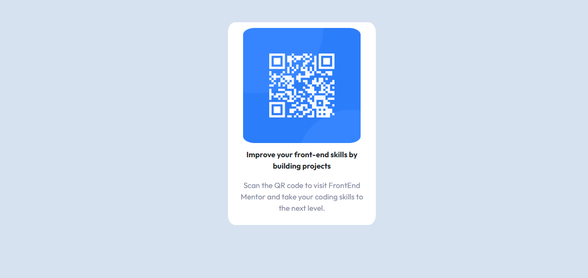

# Frontend Mentor - QR code component solution

This is a solution to the [QR code component challenge on Frontend Mentor](https://www.frontendmentor.io/challenges/qr-code-component-iux_sIO_H). Frontend Mentor challenges help you improve your coding skills by building realistic projects. 

## Table of contents

- [Overview](#overview)
  - [Screenshot](#screenshot)
  - [Links](#links)
- [My process](#my-process)
  - [Built with](#built-with)
  - [What I learned](#what-i-learned)
  - [Continued development](#continued-development)
- [Author](#author)

## Overview

### Screenshot

### Link

- Live Site URL: https://qr-code-challenge-rho.vercel.app/

## My process

### Built with

- Semantic HTML5 markup
- CSS custom properties
- Mobile-first workflow

### What I learned

Main takeaway from this project is to always make sure to add class after the source link in images. 
Second point is to remember to add CSS stylesheet AFTER the bootstrap sheet.

### Continued development

- CSS grids
- Positioning

## Author

- Website - [Amina Ibrahim](https://aminafolio.github.io/)
- Frontend Mentor - [@aminafolio](https://www.frontendmentor.io/profile/aminafolio)

